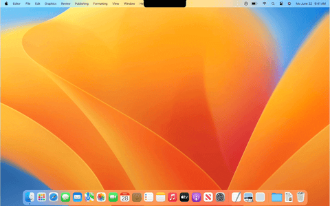
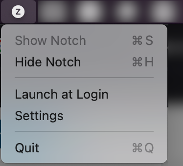

# zNotch: prompt control of Macbook's Notch

_(pronounced as "the Notch")_

> Macbook's (in)famous Notch doesn't bother me the most of the time. Once this happens or I need more screen's space for a while, I want to be able toggling/removing it in efficient and prompt way: either through a hotkey or through my own automation.

Sounds this familiar, `zNotch` is more likely a 💯 choice of yours as well as mine.

## Highlights

### No Extra Permissions

Sandboxed. `zNotch` doesn't require **any** system permissions and runs right away after installation.

### Trusted

Signed by Apple. `zNotch` has passed all Apple's checks required to receive a security signature. No warnings from Apple's Gatekeeper about suspicious software.

### Shortcuts/Automation Friendly

Hide, show and just toggle back and forth your Macbook's Notch using:

- Menubar
- Command line

Notch control over a command line allows to have/build own automation routine.

### Free

No strings attached. Ever.

## Download

Get a `.dmg` with the [latest release](https://github.com/zkondor/znotch/releases).

## Feedback

Every one of them matters [over there](https://github.com/zkondor/znotch/issues).

## System Requirements

`zNotch` is proven to work flawlessly on `mac OS` "`Monterey`" on Apple Silicon (M1/M2) macbooks.

## Notch Control

### over Menubar

### over Command Line

**Show Notch** if still hidden: `open 'xyz.kondor.znotch://v1/manage?action=show'`.

**Hide Notch** if already shown: `open 'xyz.kondor.znotch://v1/manage?action=hide'`.

**Toggle** an opposite (`Notch is visible` -> `Notch is hidden` & `Notch is hidden` -> `Notch is visible`): `open 'xyz.kondor.znotch://v1/manage?action=toggle'`.
