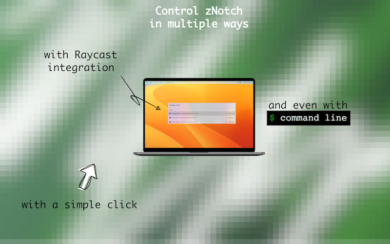

# zNotch: prompt control of Macbook's Notch

<div align="center">
  <p><u>(pronounced as "the Notch")</u></p>
  
  
  

  <a href="https://github.com/zkondor/znotch/releases/download/v1.0.0/znotch-1.0.0.dmg"></a>
  <a href="https://github.com/zkondor/homebrew-dist"></a>
</div>

> Macbook's (in)famous Notch doesn't bother me the most of the time. Once this happens or I need more screen's space for a while, I want to be able toggling/removing it in efficient and prompt way: either through a hotkey or through my own automation.

Sounds this familiar, `zNotch` is more likely a 💯 choice of yours as well as mine.

<div align="center">


</div>

## Highlights

### No Extra Permissions

Sandboxed. `zNotch` doesn't require **any** system permissions and runs right away after installation.

### Trusted

Signed by Apple. `zNotch` has passed all Apple's checks required to receive a security signature. No warnings from Apple's Gatekeeper about suspicious software.

## Raycast Integration 🤩

[`Raycast`](https://raycast.com) is a great drop-in replacement for a built-in `Spotlight`. There is an extension to control `zNotch` over `Raycast`'s omnibar.

<div align="center">
    <a href="https://www.raycast.com/zkondor/znotch"></a>
</div>

### Shortcuts/Automation Friendly

Hide, show and just toggle back and forth your Macbook's Notch using:

- Menubar
- Command line

Notch control over a command line allows to have/build own automation routine.

### Free

No strings attached. Ever.

Like the app? Just spread the word!

See the [license](license.txt) for the terms of use and credits. `Apple`, `Macbook`, `Raycast` are the trademarks of their legal owners.

<hr/>

## Download

Get a `.dmg` with the [latest release](https://github.com/zkondor/znotch/releases).

Or stay always up to date using [Brew](https://github.com/zkondor/homebrew-dist):

``` sh
brew tap zkondor/dist
brew install --cask znotch
```

## Feedback

Every one of them matters [over there](https://github.com/zkondor/znotch/issues).

## System Requirements

`zNotch` is proven to work flawlessly on `mac OS` "`Monterey`" & "`Ventura`" on Apple Silicon (M1/M2) macbooks.

## Notch Control

### over Menubar


### over Command Line

**Show Notch** if still hidden: `open 'xyz.kondor.znotch://v1/manage?action=show'`.

**Hide Notch** if already shown: `open 'xyz.kondor.znotch://v1/manage?action=hide'`.

**Toggle** an opposite (`Notch is visible` -> `Notch is hidden` & `Notch is hidden` -> `Notch is visible`): `open 'xyz.kondor.znotch://v1/manage?action=toggle'`.

### over Raycast Launcher

Using friendly [extension](https://www.raycast.com/zkondor/znotch):


